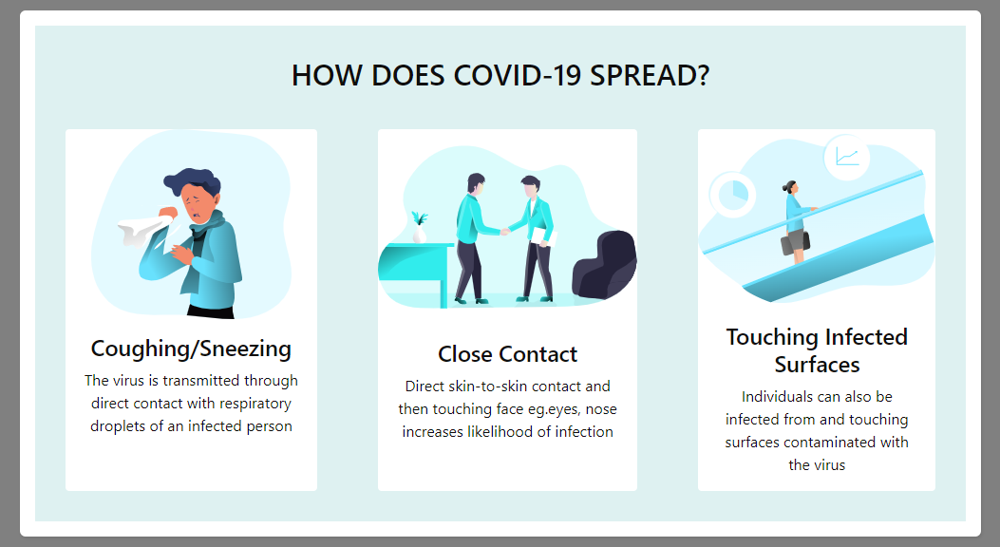

# Covid Care and Covid Cases Tracking System

This project is created using [Create React App](https://github.com/facebook/create-react-app) template. 

## Steps to run code in Visual Studio Code 

Download latest version of [Visual Studio Code](https://code.visualstudio.com/).

Create [fork](https://docs.github.com/en/get-started/quickstart/fork-a-repo) of current project.

In the project directory, you can run:

### `npm install`
### `npm start`

Runs the app in the development mode.\
Open [http://localhost:3000](http://localhost:3000) to view it in the browser.

The page will reload if you make edits.\
You will also see any lint errors in the console.

### `npm test`

Launches the test runner in the interactive watch mode.

### `npm run build`

Builds the app for production to the `build` folder.

## Azure Map Key managment in Visual code

Rename '.env_example' to '.env'. Create [azure map account](https://docs.microsoft.com/en-us/azure/azure-maps/how-to-manage-account-keys).
Then get [primary key](https://docs.microsoft.com/en-us/azure/azure-maps/how-to-manage-authentication) and update in '.env' file.

## Azure Map Key managment in gitHub Actions 

Create [secret key](https://docs.github.com/en/actions/security-guides/encrypted-secrets) 'REACT_APP_API_KEY' to store Azure Map Key in  [github secrets](https://docs.github.com/en/actions/security-guides/encrypted-secrets). Also update '.yml' which is used while code building with github actions. Add below 3 lines in .yml code in build code with github actions.

        env:
          REACT_APP_API_KEY: ${{secrets.REACT_APP_API_KEY}}
          REACT_APP_BLOB_KEY: ${{secrets.REACT_APP_BLOB_KEY}}

## Azure Blob storage

[Azure Blob storage](https://docs.microsoft.com/en-us/azure/storage/blobs/storage-blobs-introduction) is used to stored images. If you require this images, then you can copy from 'src/images_example' and use it directly by changing image path in code or you can use [Azure Blob storage](https://docs.microsoft.com/en-us/azure/storage/blobs/storage-blobs-introduction) to storge images. 

## Project ScreenShots

### [Navigating the map](https://docs.microsoft.com/en-us/azure/azure-maps/map-accessibility#navigating-the-map) 
There are several different ways in which the map can be zoomed, panned, rotated, and pitched. Check different ways to [navigate the map](https://docs.microsoft.com/en-us/azure/azure-maps/map-accessibility#navigating-the-map) using microsoft doc.

### [Keyboard shortcuts](https://docs.microsoft.com/en-us/azure/azure-maps/map-accessibility#keyboard-shortcuts)
The map has a number of [keyboard shortcuts](https://docs.microsoft.com/en-us/azure/azure-maps/map-accessibility#keyboard-shortcuts) built in that make it easier to use the map. These keyboard shortcuts work when the map has focus.

##

